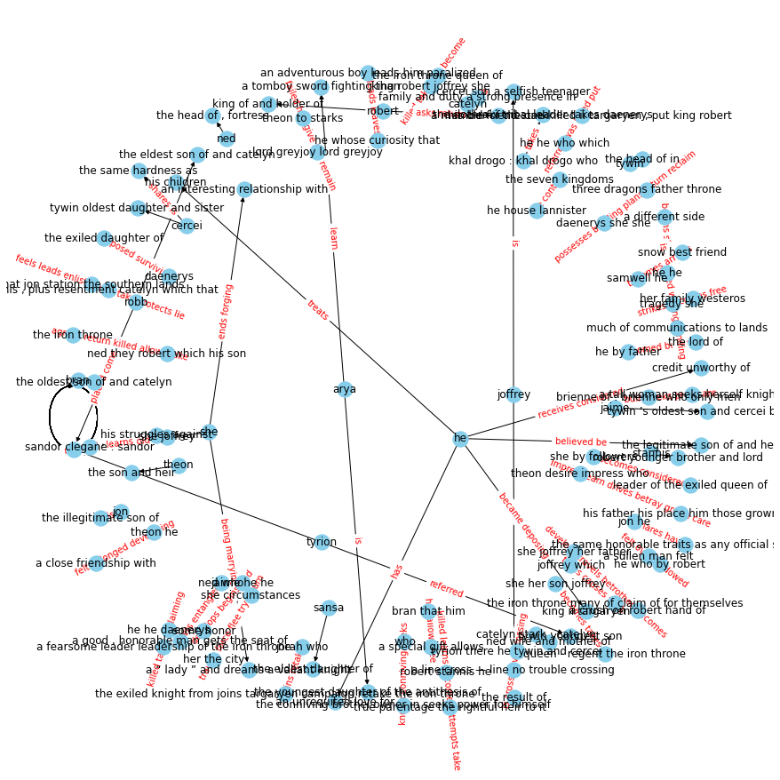
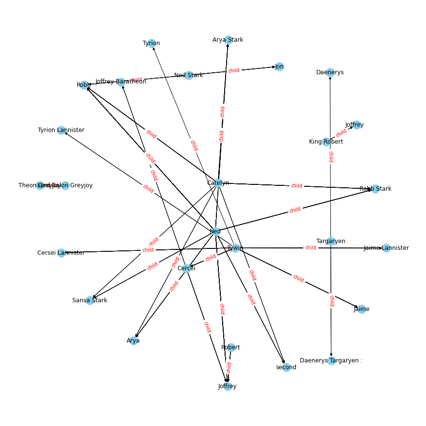
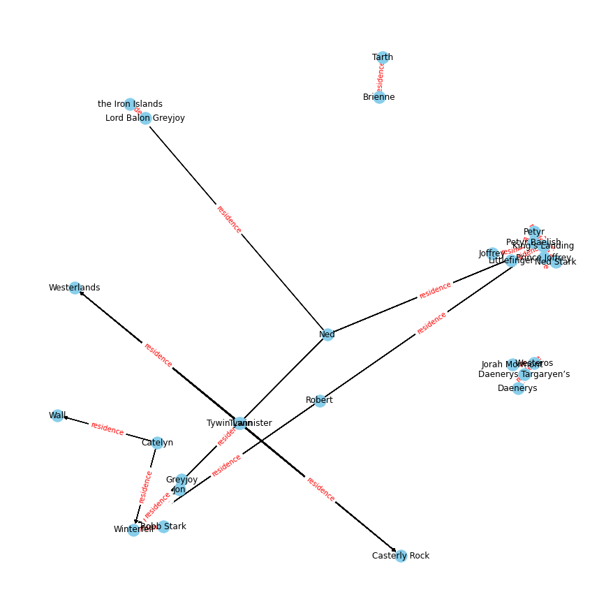

**Introduction to Information Extraction pipelines and Knowledge Graphs**

This instructional notebook demonstrates a simple spaCy-based information extraction pipeline that results in the construction of a basic knowledge graph.
It builds off of the lesson_4_spaCy.ipynb notebook which you should review first.
We'll attempt to parse a document containing characters from the Game of Thrones epic, perform entity extraction, and predict the relations between them using a distantly-supervised BERT model.

For some background, a knowledge graph (KG) represents a network of real-world entities—i.e. objects, events, situations, or concepts—and illustrates the relationship between them. This information is usually stored in a graph database and visualized as a graph structure. A KG is made up of three main components: nodes, edges, and labels. Any object, place, or person can be a node. An edge defines the relationship between the nodes.

Once a knowledge graph is complete, it allows question answering and search systems to retrieve and reuse comprehensive answers to given queries. In addition to being a machine-compatible representation of data, automatic KG creation and completion is also an active area of NLP research.

NB: We'll be working with a sample document that summarizes key characters in the GoT series. The document does not explicitly contain plot spoilers, although entities revealed in the knowledge graphs
may inadvertently reveal plot elements. Just go and watch the show or read the books if you haven't yet.


```python
# Standard imports
import sys
import itertools
from tqdm import tqdm
import pandas as pd

# NLP dependencies
import re
import spacy
import opennre

# Network graph visualization depdendencies
import networkx as nx
import matplotlib.pyplot as plt

pd.set_option('display.max_colwidth', 200)
%matplotlib inline
```

<b> A few notes on dependencies </b>

At the moment, OpenNRE (used for relation prediction) is not available as a python package. You'll need to follow a few simple steps to install it from their [opennre github readme](https://github.com/thunlp/OpenNRE). In addition to the depedencies, you'll need to download a spacy language model compatible with your spaCy
version. 


```python
print(spacy.__version__)
```

    3.0.7


```python
# ensuring we install the compatible spaCy language model
!{sys.executable} -m pip install https://github.com/explosion/spacy-models/releases/download/en_core_web_lg-3.0.0/en_core_web_lg-3.0.0.tar.gz
```

<b> Part 0: Basic text preprocessing </b>

First we'll need to read in our raw text file and convert it into a spaCy document object.


```python
nlp = spacy.load('en_core_web_lg') # load the large english language model

# Read in the document
file_name = "got_chars_v2" # from https://www.dummies.com/art-center/performing-arts/acting/game-of-thrones-characters-and-cast/
file_text = open(file_name).read()

# Strip out the actual actor names which are in parenthesis using the standard regex library
file_text = re.sub("[\(\[].*?[\)\]]", "", file_text)

# Convert the text into a spaCy document object
got_doc = nlp(file_text)
```

SpaCy has built-in sentence boundary detection to detect the span of the sentence.
We can use it to extract each sentence of our file and store them into a list, so we can perform entity and relation extraction one sentence at a time.
This of course is a bit simplistic and ignores relations that can span across the document. There may be other options
for doing document-level entity extraction available.


```python
sentences = list(got_doc.sents)
print(f"Number of sentences: {len(sentences)}")

sents = []
[sents.append(str(sentence)) for sentence in sentences]
print("First five sentences:")
sents[0:5]
```

    Number of sentences: 87
    First five sentences:


    ['Eddard  Stark :',
     'Ned is the head of House Stark and Lord of Winterfell, the ancient castle fortress of the North.',
     'Ned is a good, honorable man who gets entangled in the corruption of King’s Landing, the seat of the Iron Throne.',
     'His struggles against that corruption lead to tragedy for himself and his family.',
     '\n\n']


<b> Part 1: KG creation using subject-verb-object triples </b>

Let's use spaCy's built-in dependency parser to extract a sentence's subject, verb, and object.
We'll assume that the subject and object are two entities or nodes, and the verb is the relationship or edge that relates the nodes.
This is of course a very narrow definition of "relationship", but provides a nice first pass at understanding our document.
The function below extracts the subject, verb, object triple and is taking from the lesson 4 spaCy walkthrough notebook.


```python
# object and subject constants
OBJECT_DEPS = {"dobj", "dative", "attr", "oprd"}
SUBJECT_DEPS = {"nsubj", "nsubjpass", "csubj", "agent", "expl"}

# extract the subject, object and verb from the input
def extract_triples(doc):
    sub = []
    at = []
    ve = []
    for token in doc:
        # is this a verb?
        if token.pos_ == "VERB":
            ve.append(token.text)
        # is this the object?
        if token.dep_ in OBJECT_DEPS or token.head.dep_ in OBJECT_DEPS:
            at.append(token.text)
        # is this the subject?
        if token.dep_ in SUBJECT_DEPS or token.head.dep_ in SUBJECT_DEPS:
            sub.append(token.text)
    return " ".join(sub).strip().lower(), " ".join(ve).strip().lower(), " ".join(at).strip().lower()
```

Let's grab the s,v,o triples for each sentence, store them in separate lists,
and then combine the lists into a pandas dataframe to view the relationships
and make it easy for graph creation and visualization.


```python
# Create empty lists to store all subject, verbs, and objects

subjects = []
verbs = []
objects = []

# Grab the SVOs from each sentence

for sent in sents:
    doc = nlp(sent)
    s,v,o = extract_triples(doc)
    subjects.append(s)
    verbs.append(v)
    objects.append(o)

# store them in a df
kg_df = pd.DataFrame({'source':subjects, 'target':objects, 'edge':verbs})
kg_df.sample(5)
```


<div>
<style scoped>
    .dataframe tbody tr th:only-of-type {
        vertical-align: middle;
    }

    .dataframe tbody tr th {
        vertical-align: top;
    }

    .dataframe thead th {
        text-align: right;
    }
</style>
<table border="1" class="dataframe">
  <thead>
    <tr style="text-align: right;">
      <th></th>
      <th>source</th>
      <th>target</th>
      <th>edge</th>
    </tr>
  </thead>
  <tbody>
    <tr>
      <th>53</th>
      <td>he</td>
      <td>the legitimate son of and heir</td>
      <td>believed be</td>
    </tr>
    <tr>
      <th>61</th>
      <td>daenerys</td>
      <td>the exiled daughter of</td>
      <td>deposed surviving</td>
    </tr>
    <tr>
      <th>15</th>
      <td>she joffrey her father</td>
      <td>a crush on robert hand of</td>
      <td>develops travels betrothed becomes</td>
    </tr>
    <tr>
      <th>46</th>
      <td>tyrion there he tywin and cercei</td>
      <td>a line cross — line no trouble crossing</td>
      <td>is cross have crossing</td>
    </tr>
    <tr>
      <th>20</th>
      <td>arya</td>
      <td>a tomboy sword fighting than</td>
      <td>learn</td>
    </tr>
  </tbody>
</table>
</div>


SVO relationships work fairly well when they have simple predictable formulations.
However, the grammatical approach falls apart with more complex constructions and requires more adjustments to the SVO function logic.

Let's visualize the results as a directed graph.
Create a graph object from the [networkx library](https://networkx.org/documentation/stable/index.html).
For larger graphs that can't be stored in memory, you may want use Neo4j for scalability, although it has a steeper learning curve. We'll first need to create a graph object from the dataframe from the previous code block:


```python
# create a directed graph from a dataframe
G=nx.from_pandas_edgelist(kg_df, "source", "target", 
                          edge_attr=True, create_using=nx.MultiDiGraph())
```

Use the draw methods to visualizing the relationships (verb linkages) between subjects and objects.


```python
plt.figure(figsize=(12,12))

pos = nx.spring_layout(G)
nx.draw(G, with_labels=True, node_color='skyblue', edge_cmap=plt.cm.Blues, pos = pos)
edge_labels = nx.get_edge_attributes(G,'edge')

formatted_edge_labels = {(elem[0],elem[1]):edge_labels[elem] for elem in edge_labels} # use this to modify the tuple keyed dict if it has > 2 elements, else ignore
nx.draw_networkx_edge_labels(G,pos,edge_labels=formatted_edge_labels,font_color='red')
plt.show()
```





Clearly, the SVO method to creating KG "triples" is a very rough approach and requires standardization of relationships to be more useful. It also requires you to understand grammar rules to properly set up.
Let's try a less grammatical approach to KG creation.

<b> Part 2: KG creation using NER and relation prediction </b>

This time, we're going to try extracting entities from the document, and then use a pre-trained relation extraction model to predict the character relationships.
We'll work with SpaCy's built-in entity extraction capabilities and then use OpenNRE to predict relations.

First, a quick review on the various entity attributes you can pull out from spaCy:


```python
# Named Entity Recognition (NER) - Taken from lesson4_spaCy_examples.ipynbspaCy 

for ent in got_doc.ents:
    print(ent.text, ent.start_char, ent.end_char,
        ent.label_, spacy.explain(ent.label_))
```

    Eddard  Stark 0 13 PERSON People, including fictional
    Ned 16 19 PERSON People, including fictional
    House Stark 35 46 ORG Companies, agencies, institutions, etc.
    Winterfell 59 69 PERSON People, including fictional
    North 106 111 LOC Non-GPE locations, mountain ranges, bodies of water
    Ned 113 116 PERSON People, including fictional
    King’s Landing 182 196 ORG Companies, agencies, institutions, etc.
    the Iron Throne 210 225 LOC Non-GPE locations, mountain ranges, bodies of water
    Catelyn Stark 310 323 PERSON People, including fictional
    Catelyn 326 333 PERSON People, including fictional
    Ned 337 340 PERSON People, including fictional
    five 366 370 CARDINAL Numerals that do not fall under another type
    Catelyn 393 400 PERSON People, including fictional
    Robb 591 595 PERSON People, including fictional
    Westeros 614 622 PERSON People, including fictional
    King’s Landing 646 660 ORG Companies, agencies, institutions, etc.
    Robb Stark 663 673 PERSON People, including fictional
    Robb 676 680 PERSON People, including fictional
    Ned 702 705 PERSON People, including fictional
    Catelyn 710 717 PERSON People, including fictional
    Winterfell 730 740 PERSON People, including fictional
    Winterfell 821 831 PERSON People, including fictional
    Robb 859 863 PERSON People, including fictional
    Ned 983 986 PERSON People, including fictional
    Catelyn 991 998 PERSON People, including fictional
    Prince Joffrey 1107 1121 PERSON People, including fictional
    King’s Landing 1137 1151 ORG Companies, agencies, institutions, etc.
    Joffrey 1155 1162 PERSON People, including fictional
    Robert 1242 1248 PERSON People, including fictional
    Joffrey 1263 1270 PERSON People, including fictional
    the Iron Throne 1277 1292 LOC Non-GPE locations, mountain ranges, bodies of water
    Seven 1328 1333 CARDINAL Numerals that do not fall under another type
    Joffrey 1379 1386 PERSON People, including fictional
    Arya Stark 1399 1409 PERSON People, including fictional
    Arya 1412 1416 PERSON People, including fictional
    Ned 1445 1448 PERSON People, including fictional
    Catelyn 1453 1460 PERSON People, including fictional
    Arya 1504 1508 PERSON People, including fictional
    King’s Landing 1601 1615 ORG Companies, agencies, institutions, etc.
    Winterfell 1704 1714 PERSON People, including fictional
    Bran Stark 1728 1738 PERSON People, including fictional
    second 1753 1759 ORDINAL "first", "second", etc.
    Ned 1774 1777 PERSON People, including fictional
    Catelyn 1782 1789 PERSON People, including fictional
    Jon Snow 1979 1987 PERSON People, including fictional
    Jon 1990 1993 PERSON People, including fictional
    Ned Stark 2021 2030 PERSON People, including fictional
    Robb 2060 2064 PERSON People, including fictional
    Jon 2066 2069 PERSON People, including fictional
    House Stark 2192 2203 ORG Companies, agencies, institutions, etc.
    Catelyn 2237 2244 PERSON People, including fictional
    Winterfell 2274 2284 PERSON People, including fictional
    Jon 2292 2295 PERSON People, including fictional
    Wall 2351 2355 ORG Companies, agencies, institutions, etc.
    Tywin Lannister 2433 2448 PERSON People, including fictional
    Tywin 2451 2456 PERSON People, including fictional
    House 2472 2477 ORG Companies, agencies, institutions, etc.
    Lannister 2478 2487 PERSON People, including fictional
    Casterly Rock 2500 2513 GPE Countries, cities, states
    Westerlands 2521 2532 PERSON People, including fictional
    House 2595 2600 ORG Companies, agencies, institutions, etc.
    Lannister 2601 2610 PERSON People, including fictional
    Seven 2623 2628 CARDINAL Numerals that do not fall under another type
    Cersei Lannister 2704 2720 PERSON People, including fictional
    Cercei 2723 2729 PERSON People, including fictional
    Tywin 2733 2738 PERSON People, including fictional
    Jaime 2776 2781 PERSON People, including fictional
    King Robert 2839 2850 PERSON People, including fictional
    Joffrey   2868 2877 PERSON People, including fictional
    Cercei 2900 2906 ORG Companies, agencies, institutions, etc.
    Tyrion 2989 2995 PERSON People, including fictional
    Jaime Lannister 2998 3013 PERSON People, including fictional
    Jaime 3016 3021 PERSON People, including fictional
    Tywin 3025 3030 PERSON People, including fictional
    Cercei 3048 3054 PERSON People, including fictional
    Kingsguard 3093 3103 PERSON People, including fictional
    Game of Thrones, Jaime 3283 3305 EVENT Named hurricanes, battles, wars, sports events, etc.
    Brienne 3406 3413 PERSON People, including fictional
    Tarth 3417 3422 PERSON People, including fictional
    Tyrion Lannister 3455 3471 PERSON People, including fictional
    Tyrion 3474 3480 PERSON People, including fictional
    Tywin 3484 3489 PERSON People, including fictional
    Tyrion 3571 3577 PERSON People, including fictional
    Tyrion 3752 3758 PERSON People, including fictional
    Tywin 3828 3833 PERSON People, including fictional
    Cercei 3838 3844 PRODUCT Objects, vehicles, foods, etc. (not services)
    Robert Baratheon 3872 3888 PERSON People, including fictional
    Robert 3891 3897 PERSON People, including fictional
    Seven 3913 3918 CARDINAL Numerals that do not fall under another type
    Game of Thrones 3978 3993 EVENT Named hurricanes, battles, wars, sports events, etc.
    Robert 4048 4054 PERSON People, including fictional
    Ned Stark 4075 4084 PERSON People, including fictional
    King’s Landing 4098 4112 ORG Companies, agencies, institutions, etc.
    Ned 4143 4146 PERSON People, including fictional
    King’s Landing 4185 4199 ORG Companies, agencies, institutions, etc.
    Robert 4201 4207 PERSON People, including fictional
    Joffrey 4262 4269 PERSON People, including fictional
    the Iron Throne 4278 4293 LOC Non-GPE locations, mountain ranges, bodies of water
    Joffrey Baratheon 4296 4313 PERSON People, including fictional
    Joffrey 4316 4323 PERSON People, including fictional
    Cercei 4327 4333 PERSON People, including fictional
    the Iron Throne 4454 4469 LOC Non-GPE locations, mountain ranges, bodies of water
    Joffrey 4480 4487 PERSON People, including fictional
    Cercei 4514 4520 ORG Companies, agencies, institutions, etc.
    Jaime 4569 4574 PERSON People, including fictional
    Joffrey 4582 4589 PERSON People, including fictional
    the Iron Throne 4596 4611 LOC Non-GPE locations, mountain ranges, bodies of water
    the Iron Throne 4740 4755 LOC Non-GPE locations, mountain ranges, bodies of water
    Stannis 4793 4800 PERSON People, including fictional
    King Robert’s 4804 4817 PERSON People, including fictional
    Robert 4923 4929 PERSON People, including fictional
    Renly 4955 4960 PERSON People, including fictional
    Robert 4968 4974 PERSON People, including fictional
    Stannis 4989 4996 PERSON People, including fictional
    Joffrey 5012 5019 PERSON People, including fictional
    Daenerys 5142 5150 ORG Companies, agencies, institutions, etc.
    Targaryen 5242 5251 PERSON People, including fictional
    first 5256 5261 ORDINAL "first", "second", etc.
    Dothraki 5311 5319 PERSON People, including fictional
    Khal Drogo 5335 5345 PERSON People, including fictional
    Drogo 5353 5358 PERSON People, including fictional
    Seven 5455 5460 CARDINAL Numerals that do not fall under another type
    Daenerys 5488 5496 ORG Companies, agencies, institutions, etc.
    three 5507 5512 CARDINAL Numerals that do not fall under another type
    Westeros 5593 5601 PERSON People, including fictional
    Theon Greyjoy 5636 5649 PERSON People, including fictional
    Lord Balon Greyjoy 5681 5699 PERSON People, including fictional
    the Iron Islands 5703 5719 LOC Non-GPE locations, mountain ranges, bodies of water
    Greyjoy 5741 5748 PERSON People, including fictional
    Robert 5781 5787 PERSON People, including fictional
    Greyjoy 5794 5801 PERSON People, including fictional
    Starks 5827 5833 PERSON People, including fictional
    Winterfell 5845 5855 GPE Countries, cities, states
    Ned 5873 5876 PERSON People, including fictional
    Greyjoy 5897 5904 PERSON People, including fictional
    the Iron Islands 5932 5948 LOC Non-GPE locations, mountain ranges, bodies of water
    Winterfell 5991 6001 PERSON People, including fictional
    Robb Stark 6046 6056 PERSON People, including fictional
    Iron Islands 6129 6141 LOC Non-GPE locations, mountain ranges, bodies of water
    Westeros 6250 6258 PERSON People, including fictional
    Daenerys Targaryen’s 6269 6289 PERSON People, including fictional
    the Iron Throne 6309 6324 LOC Non-GPE locations, mountain ranges, bodies of water
    Sandor Clegane 6369 6383 PERSON People, including fictional
    Sandor 6386 6392 PERSON People, including fictional
    The Hound 6421 6430 WORK_OF_ART Titles of books, songs, etc.
    Arya Stark 6560 6570 PERSON People, including fictional
    Samwell Tarly 6607 6620 PERSON People, including fictional
    Samwell 6623 6630 PERSON People, including fictional
    Jon Snow’s 6639 6649 PERSON People, including fictional
    Petyr 6843 6848 PERSON People, including fictional
    Littlefinger 6865 6877 PERSON People, including fictional
    King’s Landing 6914 6928 ORG Companies, agencies, institutions, etc.
    Catelyn Stark 6993 7006 PERSON People, including fictional
    Brienne 7009 7016 PERSON People, including fictional
    Tarth 7020 7025 PERSON People, including fictional
    Brienne 7028 7035 PERSON People, including fictional
    Jaime Lannister 7253 7268 PERSON People, including fictional
    Khal Drogo 7271 7281 PERSON People, including fictional
    Khal Drogo 7284 7294 PERSON People, including fictional
    Dothraki 7302 7310 PERSON People, including fictional
    Daenerys 7335 7343 ORG Companies, agencies, institutions, etc.
    Daenerys 7406 7414 ORG Companies, agencies, institutions, etc.
    first 7457 7462 ORDINAL "first", "second", etc.
    the Iron Throne 7486 7501 LOC Non-GPE locations, mountain ranges, bodies of water


SpaCy's NER works really well out of the box!
It identifies the characters and families, the character position of the entities within the document object, and the entity type.
As an optional step, you may want to perform coreference resolution to narrow down entities that have multiple aliases and associations.
Hugging face's [Neuralcoref](https://spacy.io/universe/project/neuralcoref) module is a great neural-network based option for doing this and runs on top of spaCy.
(Note: Neuralcoref installation is finnicky; recommend using pip install with python 3.7 and spaCy 2.1.0)

Let's now explore [OpenNRE](https://github.com/thunlp/OpenNRE), an open source neural relation extraction model that uses [distant supervision](https://web.stanford.edu/~jurafsky/mintz.pdf) to extract relations between pairs. Distant supervision is an scalable learning technique that uses "seed" entities and relations from preexisting databases like Freebase and Wikipedia to generate large amounts of new labeled training data to train a model from.

We'll use a BERT model trained on Wikipedia articles provided by OpenNRE. This model can infer up to 80 relation types.


```python
# Instantiate the NER model
# Lots of options here but bert entity trained on wiki 80 works well.
model = opennre.get_model('wiki80_bertentity_softmax')
```

    2021-09-07 17:32:05,671 - root - INFO - Loading BERT pre-trained checkpoint.


TODO: troubleshoot why spaCy NER does not recognize all entities at times.


```python
test_1 = "He and his wife, Catelyn, have five children: Robb, Sansa, Arya, Bran, and Rickon."
test_doc_1 = nlp(test_1)
test_doc_1.ents
```


    (Catelyn, five, Robb, Rickon)


OpenNRE must be provided with the sentence, and the start and end characters of each entity within the sentence.
This is where spaCy's ent.start_char and ent.end_char attributes come in handy. The OpenNRE model will then predict the relation
and its probability. Here's the example from the project repo where "Máel Dúin mac Máele Fithrich" is the source entity
and "Áed Uaridnach" is the target entity. The model correctly predicts that the target entity is the father of the source entity:


```python
model.infer({'text': 'He was the son of Máel Dúin mac Máele Fithrich, and grandson of the high king Áed Uaridnach (died 612).',
             'h': {'pos': (18, 46)}, 't': {'pos': (78, 91)}})
```


    ('father', 0.9927453398704529)


Let's loop through each sentence of the document, extract all permutations of entities and their start and end positions,
and then use the BERT entity model pre-trained on Wikipedia to predict relations among all pairs within the sentence.
We'll store the outputs in a running dataframe after each sentence is completed.
We need to use permutations because the relation from <b>A</b> to <b>B</b> may not directionally be the same as the relation from <b>B</b>
to <b>A</b>. For instance, if <b>A</b> is the child of <b>B</b>, this would imply <b>B</b> is the <i>parent</i> (not child) of <b>A</b>.


```python
appended_data = []

for sent in tqdm(sents, desc="Sentence-level entity and relation extraction"):

    sent_doc = nlp(sent)

    source_list = []
    target_list = []
    relation_list = []
    rel_proba_list = []

    # create a lookup of start and end char tuples for each entity
    # exclude cardinal value entity types
    
    ents_dict = {(ent.text): (ent.start_char, ent.end_char) for ent in sent_doc.ents if ent.label_ != "CARDINAL"}
    
    # loop through all permutations of relationships and calculate and store the relations
    for pair in itertools.permutations(ents_dict.keys(),2):

        # predict relation using openNRE model
        rel, proba = model.infer({'text': sent,
                                  'h': {'pos': ents_dict.get(pair[0])},
                                  't': {'pos': ents_dict.get(pair[1])}})

        # store predictions, probabilities, source, and target nodes to lists, and then a dataframe
        relation_list.append(rel)
        rel_proba_list.append(proba)
        source_list.append(pair[0])
        target_list.append(pair[1])

        # store all data per sentence into a dataframe, which we will combine into a document-level dataframe
        sent_df = pd.DataFrame({'source':source_list, 'target':target_list, 'edge':relation_list, 'rel_proba':rel_proba_list})
        appended_data.append(sent_df)

# document-level entity relation dataframe (derived from sentences)
kg2_df = pd.concat(appended_data, ignore_index=True)
kg2_df
```

    Sentence-level entity and relation extraction: 100%|█| 87/87 [00:35<00:00,  2.46


<div>
<style scoped>
    .dataframe tbody tr th:only-of-type {
        vertical-align: middle;
    }

    .dataframe tbody tr th {
        vertical-align: top;
    }

    .dataframe thead th {
        text-align: right;
    }
</style>
<table border="1" class="dataframe">
  <thead>
    <tr style="text-align: right;">
      <th></th>
      <th>source</th>
      <th>target</th>
      <th>edge</th>
      <th>rel_proba</th>
    </tr>
  </thead>
  <tbody>
    <tr>
      <th>0</th>
      <td>Ned</td>
      <td>House Stark</td>
      <td>member of</td>
      <td>0.917124</td>
    </tr>
    <tr>
      <th>1</th>
      <td>Ned</td>
      <td>House Stark</td>
      <td>member of</td>
      <td>0.917124</td>
    </tr>
    <tr>
      <th>2</th>
      <td>Ned</td>
      <td>Winterfell</td>
      <td>residence</td>
      <td>0.927599</td>
    </tr>
    <tr>
      <th>3</th>
      <td>Ned</td>
      <td>House Stark</td>
      <td>member of</td>
      <td>0.917124</td>
    </tr>
    <tr>
      <th>4</th>
      <td>Ned</td>
      <td>Winterfell</td>
      <td>residence</td>
      <td>0.927599</td>
    </tr>
    <tr>
      <th>...</th>
      <td>...</td>
      <td>...</td>
      <td>...</td>
      <td>...</td>
    </tr>
    <tr>
      <th>2407</th>
      <td>Daenerys</td>
      <td>the Iron Throne</td>
      <td>residence</td>
      <td>0.410777</td>
    </tr>
    <tr>
      <th>2408</th>
      <td>first</td>
      <td>Daenerys</td>
      <td>participant</td>
      <td>0.766528</td>
    </tr>
    <tr>
      <th>2409</th>
      <td>first</td>
      <td>the Iron Throne</td>
      <td>main subject</td>
      <td>0.539772</td>
    </tr>
    <tr>
      <th>2410</th>
      <td>the Iron Throne</td>
      <td>Daenerys</td>
      <td>participant</td>
      <td>0.479980</td>
    </tr>
    <tr>
      <th>2411</th>
      <td>the Iron Throne</td>
      <td>first</td>
      <td>main subject</td>
      <td>0.450599</td>
    </tr>
  </tbody>
</table>
<p>2412 rows × 4 columns</p>
</div>


A quick look at the type of relations extracted from the Wiki80-trained BERT model.


```python
kg2_df["edge"].value_counts()
```


    residence                                     492
    father                                        291
    child                                         214
    characters                                    211
    sibling                                       162
    said to be the same as                        146
    member of                                     140
    spouse                                        139
    mother                                        130
    has part                                       86
    head of government                             84
    located on terrain feature                     51
    headquarters location                          39
    location                                       37
    occupant                                       32
    part of                                        30
    position held                                  27
    instance of                                    25
    religion                                       21
    applies to jurisdiction                        18
    country of citizenship                         10
    participant                                     8
    owned by                                        7
    participant of                                  6
    main subject                                    4
    contains administrative territorial entity      2
    Name: edge, dtype: int64


Let's plot a few of the graphs from the document, re-using the networkx code from the previous block.
We'll pass in edge type and a model prediction threshold to filter out low-probability predictions.


```python
def draw_relations(rel_type, pred_thresh=0.5):
    G2=nx.from_pandas_edgelist(kg2_df[(kg2_df["rel_proba"]>pred_thresh)&(kg2_df["edge"]==rel_type)],
                               "source", "target", edge_attr=True, create_using=nx.MultiDiGraph())

    plt.figure(figsize=(12,12))

    pos = nx.spring_layout(G2) # other layouts may be more appropriate depending on the graph type
    nx.draw(G2, with_labels=True, node_color='skyblue', edge_cmap=plt.cm.Blues, pos = pos)
    edge_labels = nx.get_edge_attributes(G2,'edge')

    formatted_edge_labels = {(elem[0],elem[1]):edge_labels[elem] for elem in edge_labels} # use this to modify the tuple keyed dict if it has > 2 elements, else ignore
    nx.draw_networkx_edge_labels(G2,pos,edge_labels=formatted_edge_labels,font_color='red')
    plt.show()
```


```python
# Graph of children relationships
draw_relations(rel_type="child", pred_thresh=0.9)
```





```python
# Graph of where characters might reside
draw_relations(rel_type="residence", pred_thresh=0.7)
```





For those who are familiar with the story, most of these relationships will look accurate. The cleanliness of the KG
representation will largely depend on how well NER performs. As mentioned, we could improve the pipeline if we added coreference resolution and/or entity linking
to disambiguate entity names. Such techniques would help resolve multiple character aliases into a single entity.
For example, "Daenerys Targaryen" would resolve to her multiple aliases including "Daenarys Stormborn", "Khaleesi",
and "The Mother of Dragons", which would make for a tighter graph.

There are a number of other various end-to-end and modular approaches to deriving KG triples and KG completion.
The aim of this notebook was to demonstrate how one could build a simple pipeline using off-the-shelf libraries
to achieve this goal.
